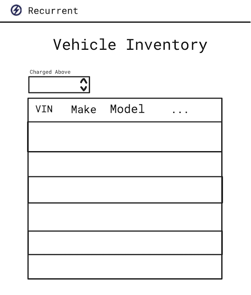

# Recurrent Software Developer Take-Home Assignment

## Welcome!

Thank you for applying to Recurrent and participating in this front-end assignment.
The goal of this assignment is to give us a look at your development approach and
give us something to talk about in the face-to-face interviews. We do not expect
you to complete everything single thing in this assignment! Just spend two to three
hours working on it and then submit it. That should give us plenty to talk about.

## The assignment

At Recurrent, we work with data we collect from people’s electric vehicles
(EVs). We collect between one and three data points a day (usually)
from each vehicle.

We have a page that shows a list of all the vehicles in the database.
It looks like the following:


Since then, we have added more data in the API and have started to gather data
points for some of the vehicles.

The API is available at http://localhost:3000/api/ with the following endpoints:

- `/vehicles` - This will return all the vehicles in the system as an array, each with the following data:
  - `vin`
  - `mmy` which will contain:
    - `make`
    - `model`
    - `year`
  - `color`
  - `created_at` - The database creation date, not the date the vehicle was manufactured
- `/vehicles/[vin]` - This will return the same information as `/vehicles` but for only the vehicle that is specified in the vin
- `/datapoints` - This will return all vehicle charge status information as an array, each with the following data:
  - `vin`: A unique identifier tied to the vehicle, expressed as a
    string.
  - `charge_reading`: The vehicle’s State of Charge (SoC), a decimal number
    representing the current charge level of the battery in terms of percentage.
    (For example, 0.33 means the battery is 33% charged.)
  - `range_estimate`: The estimated range that the vehicle can drive before the
    battery is depleted, expressed in miles as a decimal number.
  - `odometer`: The vehicle’s current odometer reading, expressed in miles as an
    integer.
  - `plugged_in`: Whether or not the vehicle is plugged in at the time of the
    reading, expressed as a boolean.
  - `charging`: Whether or not the vehicle is actively charging at the time of
    the reading, expressed as a boolean.
  - `created_at`: Timestamp of the reading, expressed in a string of the format
    "yyyy-mm-dd hh:mm:ss", the timezone is UTC for all readings.
- `/vehicles/[vin]/datapoints` - This will return an array of datapoints for the specified vehicle
- Note: if we don't have data for something, we want the text "N/A" to show up in that spot so that
  the user knows that we are missing the data.

We have two coding tasks and one writing task:

## Task 1: Build out the vehicle list page

Expand the information shown on the table to include Make, Model, Year and Color.
These should be new columns in the table and should follow the same general style
of what is already there.

## Task 2: Add a new view page for vehicles

Add a 'View Vehicle' page to show all the vehicle's information. Add the link
to the details page in the Vehicles list under a column named "View Vehicle".
On the vehicle details page include the following information derived from the
vehicle's `datapoints`:

1.  `Charged Above 80%`: This field should indicate whether the vehicle
    reported at least one `charge_reading` above 80% over the whole time
    period.
2.  `Latest Odometer`: This field should show the latest odometer reading for
    the vehicle.
3.  `Latest Data Point Timestamp`: This field should show the timestamp for
    most recent data point recorded for the vehicle.


## Task 3: Write a ticket for a teammate to implement a filtering feature

Imagine a teammate is planning to expand on your work and implement a new
feature in the next sprint. This feature will allow the user to filter the
vehicles list page based on vehicles that had been charged above a given
`charge_reading` percentage over the whole time period. For example, if a
vehicle has data points with charge readings: `[.3, .9, .8, .8]`, we would not
say the vehicle had been charged above 90%, however, we would say the vehicle
had been charged above 80%.

This repo contains an api endpoint that will do that filtering, if passed a
valid charge percentage value. Your task is to write up a ticket outlining the
work and any questions that might need answering in order to implement this
feature. We have included a rough mock-up of the front end user experience,
but feel free to update it or call out suggestions for a better UX.



Include your suggestions, and other questions and comments in your `SUMMARY.md`
file. We expect to see you call out where requirements or designs are ambiguous
and suggest some potential approaches, but try to avoid prescribing exact
implementation details.

## How to use

Download the example [or clone the repo](https://github.com/recurrentauto/recurrent-software-dev-hw-ts):

<!-- #default-branch-switch -->

```sh
git clone git@github.com:recurrentauto/recurrent-software-dev-hw-ts.git
cd recurrent-software-dev-hw-ts
```

Install it and run:

```sh
npm install
npm run dev
```

This will start the application on http://localhost:3000/.

## The starting application

The project uses [React](https://reactjs.org/docs/getting-started.html) and [Next.js](https://github.com/vercel/next.js), which is a framework for server-rendered React apps, which we use at Recurrent for our front-end.

It includes `@mui/material` and its peer dependencies, including `emotion`, the default style engine in MUI v5. If you prefer, you can [use styled-components instead](https://mui.com/guides/interoperability/#styled-components).

### The starting pages & components

If you're running the application locally, there's a starting page with a bunch
of examples at http://localhost:3000/about.

This page shows a whole bunch of MUI components using a predefined style. You
can find the component that renders all of these in
`src/ExampleMUIComponents.tsx`. This is meant to be a starting place for you to
see what different things will look like in our style!

More information about routing to different pages can be found [in the documentation](https://mui.com/guides/routing/#next-js).

## What we expect:

- We don't expect you to spend more than ~2-3 hours on this. Please don’t
  spend any longer on it, even if you didn’t finish it. That is fine! The next
  stage of the interview process builds on this work.
- There is no deadline for this, go ahead and send it to us when you are
  ready.
- Submit your solution source code files to us by emailing them to us. You can
  choose one of the following ways:
  - Upload your project to the submission link at the bottom of the assignment email
  - Email a link to a private github repo
  - Email a link to a zip file hosted on a cloud service (dropbox, etc…)
- We prioritize readable code that meets the requirements.
- We expect to see some automated tests for important functionality.
- Most importantly, we expect you to include a SUMMARY.md. This should contain:
  - Information about assumptions and decisions you made along the way! We’d
    love to hear your thought-process and any tradeoffs you made.
  - A discussion of what would you would think about improving if you spent
    more time on it (and why).
  - The ticket write-up from Task 3.

## Questions we'd like you to consider during this assignment

Here's a look into our brains at Recurrent -- we often ask these types of
questions while doing our work.

- What is a good balance between reusable code that’s maintainable vs. super
  custom and a super great experience for a specific use case?
- Consider adding tests where it’s useful, but we don’t need to test
  everything
- When we write tickets we often don’t prescribe an implementation, but
  describe that the outcome should be and any questions and considerations
  along the way
- Whenever choosing a component, please discuss why you chose the component.
  Discuss any thoughts you have on things like accessibility, ease of
  implementation, etc. For example, choosing to use a `Paper` component vs. a
  `Card` or choosing a `Link` vs. `Button` (or even which type of `Link`).
- We also like to consider code organization. Does it make sense for a
  calculation to be a part of a component file, a separate module, or even an
  api concern?
